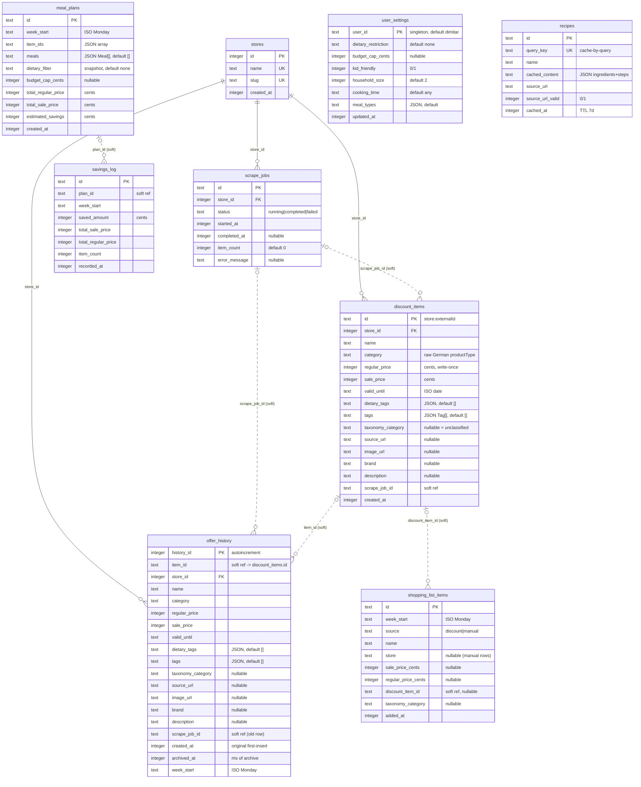

# Database schema

Entity-relationship diagram of the SQLite schema. **Source of truth: `src/shared/schema.ts`** (Drizzle defs; the runtime DDL generator in `src/shared/schema-ddl.ts` builds the tables from it). Regenerate this diagram from that file if the schema changes.

## Notes

- **Solid `||--o{`** — enforced FK to `stores(id)` (three: `scrape_jobs`, `discount_items`, `offer_history`; `foreign_keys=ON`).
- **Dashed `|o..o{`** — soft ref by design (no FK): append-only (`scrape_job_id`), price-history join key (`offer_history.item_id`), or snapshot / weekly-regen links (`shopping_list_items.discount_item_id`, `savings_log.plan_id`). Hard FKs would fight delete-reinsert (replace-per-store scrape) and weekly regeneration.
- `offer_history` mirrors `discount_items` + `archived_at` / `week_start`; PK is a surrogate `history_id` because `item_id` repeats across weekly archives. Populated by archive-on-replace inside `SQLiteDiscountItemRepository.replaceStore`.
- `stores` is name-at-boundary: canonical list in `src/shared/stores.ts`, id resolution in `src/shared/store-registry.ts`; domain/HTTP/tests stay name-based.
- `user_settings` (single-user singleton) and `recipes` (query cache, 7-day TTL) are standalone — no relationships.
- Types shown are SQLite affinities (`integer` / `text`); cents are integers, timestamps are ms-since-epoch integers, ISO dates/JSON payloads are text.
