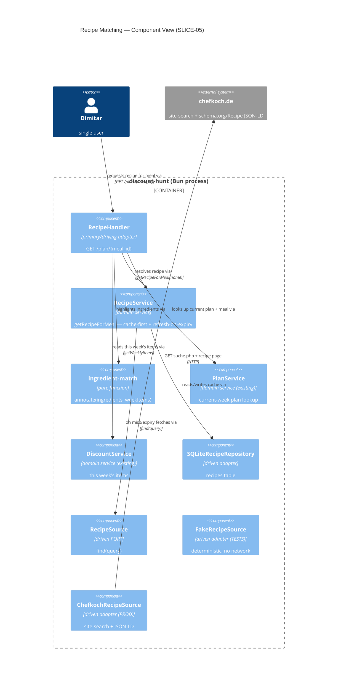

# DESIGN — SLICE-05: Recipe integration (Chefkoch site-search)

**Wave**: DESIGN · **Author**: Morgan (solution-architect) · **Date**: 2026-07-15
**Status**: Ready for DISTILL
**Supersedes**: `docs/product/architecture/brief.md` §"Recipe Matching" (Brave-based design) — see [§0 Supersession](#0-supersession-notice).

---

## 0. Supersession notice

The architecture brief (`brief.md`) still describes the Recipe Matching context around **Brave Search + three
adapters** (`brave-search-client.ts`, `chefkoch-recipe-fetcher.ts`, `recipe-source-probe.ts`) and references Brave in
D14 / D16 / D19 and the container/component C4 diagrams. **SPIKE-02 was closed on 2026-07-15 with the locked decision
to drop Brave** (`spike/findings-02-recipe-source.md`, closure table 3/3 live). This design therefore **collapses the
two ACL adapters into a single driven port `RecipeSource` with one live adapter `ChefkochRecipeSource`**. No API key,
no second external system.

This is a deliberate supersession, not an omission. The brief should be updated (or annotated) to match; that edit is
out of scope for this slice and is listed as an open question ([OQ-4](#open-questions--risks)).

**Also deferred vs. the brief**: D36 (4-week recipe rotation / `getRecentRecipeIds`) is *not* in this slice's scope —
see [OQ-5](#open-questions--risks).

---

## 1. Scope and quality attributes

Completes the **discount → plan → cook** loop: every meal in the current plan links to a real recipe with steps and a
source URL, and the recipe view highlights which of its ingredients are on sale this week.

| Quality attribute (ISO 25010) | How this design addresses it |
|---|---|
| **Testability** (Maintainability) | `RecipeSource` port is the seam. **The network is never hit in the test suite** — every behavior is asserted through `FakeRecipeSource`. The one live adapter is validated by the SPIKE probe, not unit tests. |
| **Reliability** (fault tolerance) | Two fallbacks: dead source URL → cached content + notice; no match → ingredient + manual search link. Cache-first read means a down Chefkoch never blocks a *fresh* recipe view. |
| **Performance** | Cache-first with 7-day TTL. ~5 lookups/week; a cache hit is a single SQLite `SELECT`, no network. |
| **Security** (integrity) | All interpolated text (recipe name, ingredients, steps, store names, search query) escaped via `escapeHtml`. Chefkoch data is untrusted scraped input — same stored-XSS discipline as discount names. External link uses `rel="noopener"`. |
| **Functional suitability** | Honest, display-only ingredient↔discount matching; documented accuracy limits ([§9](#9-ingredientdiscount-highlighting)). |

**Right-sizing**: single-user, one Bun process, one SQLite file. No new external system, no queue, no cache store.
Ports/adapters + Drizzle + `renderPage` shell — consistent with every existing context.

---

## 2. Component overview (hexagonal)



`RecipeService` depends on the **port**, never on Chefkoch. Prod wires `ChefkochRecipeSource`; tests wire
`FakeRecipeSource`. Dependencies point inward (adapters → ports → domain).

---

## 3. `RecipeSource` port + adapters (task 1)

Driven port — the single testability seam.

```
port RecipeSource:
  find(query: string): Promise<FetchedRecipe | null>

type FetchedRecipe = {
  name: string
  ingredients: string[]     // recipeIngredient[] — German free text, stored as-is
  steps: string[]           // flattened recipeInstructions (HowToStep text, section nesting resolved)
  sourceUrl: string         // recipe.url ?? recipe.mainEntityOfPage  (Chefkoch omits url)
}
```

`find` returns `null` when the source produces nothing usable (no search hit, or the page has no `@type:"Recipe"`
JSON-LD). It is **read-only** — this driven port exposes no write method (consistent with effect-isolation:
a "find" seam must not be able to mutate).

### `ChefkochRecipeSource` (LIVE — production only)
Implements the SPIKE-02 flow exactly:
1. `GET https://www.chefkoch.de/suche.php?suche=<encoded query>` (Chrome UA).
2. First `/rezepte/<id>/<slug>.html` link in the results HTML.
3. `GET` that page; extract `<script type="application/ld+json">` blocks; find `@type:"Recipe"` (string or array).
4. Map: `name`, `recipeIngredient[]`, flatten `recipeInstructions` (HowToSection > HowToStep) to `steps[]`,
   `sourceUrl = url ?? mainEntityOfPage`.
5. Any HTTP failure, missing link, or missing Recipe JSON-LD → return `null` (never throw into the domain).

**Validation**: exercised by the SPIKE-02 probe (`/tmp/spike_discount_hunt_02/probe.ts`, 3/3 live) — **NOT** by the
unit suite. This adapter is the one place the real network lives; it is checked by a probe on the substrate, per the
Earned-Trust principle, not by tests that would otherwise hit chefkoch.de. A production startup probe (deferred, see
[OQ-6](#open-questions--risks)) may re-run one live query to confirm the JSON-LD shape still holds.

### `FakeRecipeSource` (TESTS — all of them)
Deterministic, in-memory, no I/O. Constructed with a canned `Map<query, FetchedRecipe | null>` (or a default recipe).
Returns configured results so tests assert observable output. **The suite never reaches Chefkoch.** This is the seam
that makes SLICE-05 testable.

---

## 4. `recipes` table + guarded migration (task 2)

Follows the `db.ts` `CREATE TABLE IF NOT EXISTS` + try/catch `ALTER` idiom and adds a Drizzle definition to `schema.ts`.

### Columns (task 2 is authoritative over the brief's older aggregate shape)

| Column | Type | Notes |
|---|---|---|
| `id` | TEXT PK | UUID |
| `query_key` | TEXT NOT NULL **UNIQUE** | normalized lookup key (the meal/ingredient name, lowercased/trimmed). Cache-by-query. |
| `name` | TEXT NOT NULL | recipe title |
| `cached_content` | TEXT NOT NULL | JSON `{ ingredients: string[], steps: string[] }`. **NOT NULL** — a recipe without cached content is never persisted (brief invariant). `ingredients[]`/`steps[]` are *derived by parsing this column*, not stored as separate columns. |
| `source_url` | TEXT NOT NULL | `url ?? mainEntityOfPage` from JSON-LD |
| `source_url_valid` | INTEGER NOT NULL DEFAULT 1 | SQLite boolean (0/1). Last reachability verdict. |
| `cached_at` | INTEGER NOT NULL | ms epoch. Canonical freshness; **TTL = 7 days** keyed here. |

### DDL + migration (idiom mirror of `db.ts`)
- Add `const CREATE_RECIPES = "CREATE TABLE IF NOT EXISTS recipes (...)"` and `sqlite.exec(CREATE_RECIPES)` in
  `createDb`, before the startup probe block.
- No `ALTER` guards needed for a brand-new table (guards only exist for columns added to *pre-existing* tables). If a
  future column is added to `recipes`, follow the same `try { ALTER } catch {}` guard idiom.
- `UNIQUE(query_key)` gives INSERT-OR-REPLACE cache semantics and makes "two rows for one query" non-representable.

**Migration-guard AT** (regression class already established in this repo): opening a DB whose `recipes` table
pre-dates a future column must not throw — the guarded `ALTER` swallows the duplicate-column error.

---

## 5. `RecipeRepository` port + `SQLiteRecipeRepository` (task 3)

Replaces the `__SCAFFOLD__` stub. **Kept as one cohesive driven repository** (read + write together) — this is a
*driven* port, so the driving read/write split mandate does not apply; splitting a single-user cache repo would be
over-engineering.

```
port RecipeRepository:
  getByQuery(queryKey: string): CachedRecipe | null   // read (fresh OR stale — caller checks TTL)
  cache(recipe: CachedRecipe): void                   // INSERT OR REPLACE by query_key
  markSourceDead(id: string): void                    // source_url_valid = 0; cached_content untouched
  refresh(id, data): void                             // update name/content/source_url/cached_at/valid
```

`CachedRecipe` = row shape (`id, queryKey, name, ingredients[], steps[], sourceUrl, sourceUrlValid, cachedAt`);
`ingredients`/`steps` parsed from `cached_content` on read, serialized on write.

**Invariants** (enforced at the adapter): `cached_content` written NOT NULL on every `cache`; `markSourceDead` changes
*only* `source_url_valid` and preserves `cached_content` (brief D-complement). Real SQLite via Drizzle, `bun:sqlite`.

---

## 6. `RecipeService` (task 4)

Replaces the `__SCAFFOLD__` stub. Constructor deps: `RecipeRepository`, `RecipeSource`. (Drops the 3-arg
Brave/fetcher signature from the stub.)

```
getRecipeForMeal(mealName): Promise<ResolvedRecipe | null>
```

**Contract shape** (effect-isolation classification): `getRecipeForMeal` is a *bounded-change* function. Declared
mutation set = at most one `recipes` row for `queryKey(mealName)` (via `cache` / `markSourceDead`). It never mutates any
other aggregate. The read/write universe is a single query key.

### Logic — the re-validation seam (the correctness-critical part)

```
queryKey := normalize(mealName)          // lowercase, trim
cached   := repo.getByQuery(queryKey)

if cached and FRESH (now - cached_at < 7d):
    return cached                         # NO network, NO re-check; trust stored source_url_valid

# miss OR expired → this is the ONLY place we re-validate:
fetched := recipeSource.find(queryKey)    # network in PROD; deterministic in TESTS

if fetched != null:
    repo.cache({ ... , source_url_valid: true, cached_at: now })
    return fresh recipe

# fetched == null (source no longer reachable / no result):
if cached != null:                        # we had a stale copy
    repo.markSourceDead(cached.id)
    return cached WITH { sourceUrlValid: false }   # fallback (a): cached + "unavailable"
return null                               # nothing cached and nothing found → fallback (b)
```

**Why re-validation lives here and not in the view**: the AC says "if source URL is unreachable **when re-validated**."
Putting a liveness HTTP check in the view path would (1) put the network on every page load and (2) make the network
impossible to keep out of tests. Instead, `source_url_valid` is set through the **refresh-on-expiry** path: a fresh
cache is trusted as-is; only an *expired* cache triggers `RecipeSource.find` again, and a `null` result there flips the
flag. `FakeRecipeSource` returning `null` on the refresh attempt exercises the entire "dead source" path with **zero
network**.

**Honest limitation (state in doc + code comment)**: a *fresh-but-newly-dead* URL (source died inside the 7-day
window) shows **no** "unavailable" notice until the next expiry re-check. The window is small and this is display-only;
accepted for v1. This is exactly what "when re-validated" licenses.

---

## 7. `RecipeHandler` — GET `/plan/{meal_id}` (task 5)

Primary (driving) adapter. `meal_id = {day}-{slot}`, e.g. `1-lunch`. Meal has no id field — key by day+slot in the
**current** plan (SPIKE-02 locked decision).

Deps: `PlanService` (current plan), `RecipeService` (recipe), `DiscountService` (this week's items for highlighting).

### Flow
1. Parse `meal_id`: `split("/plan/")[1]`, then split on the **first** `-` → `day` (int) + `slot` (rest). Slots
   (`lunch`/`dinner`) contain no hyphen, so first-hyphen split is unambiguous.
2. `plan := planService.getOrGenerateCurrentWeekPlan()`. Find `meal` where `meal.day === day && meal.slot === slot`.
   Not found (bad/stale meal_id) → 404 (`renderPage` with a "meal not found — back to plan" body).
3. `recipe := recipeService.getRecipeForMeal(meal.name)`.
4. `weekItems := discountService.getWeeklyItems(currentWeekMonday(), plan.dietaryFilter)` — the **live** feed
   ("*currently* in the discount feed" per AC), filtered by the plan's snapshotted restriction.
5. Render via `renderPage({ title, activeNav: "plan", body })`.

### View content (all interpolated text escaped)
- `<h1>` recipe name.
- **Ingredient list** with highlighting: each ingredient row; if it matches a `weekItems` entry ([§9](#9-ingredientdiscount-highlighting)), append a badge showing **store + sale price** (`data-on-sale` marker + `formatEuros`).
- **Steps** — ordered list.
- **"Open original recipe ↗"** — `<a href="{escaped source_url}" target="_blank" rel="noopener">`.
- If `recipe.sourceUrlValid === false` → **"unavailable" notice** (`.staleness-warning` class already in `layout.ts`) above the content: "Original source is currently unavailable — showing the last cached version."
- **"Back to meal plan"** — `<a href="/plan">`, always present in every branch (including 404 and both fallbacks).

`renderPage` is pure/return-only (body passed verbatim) — asserted markers survive.

---

## 8. Fallbacks (task 6)

| Fallback | Trigger | Rendered |
|---|---|---|
| **(a) source dead** | `getRecipeForMeal` returns a recipe with `sourceUrlValid === false` (set by refresh-on-expiry, §6) | Cached name + ingredients + steps + **"unavailable" notice**. "Open original recipe" link still shown (points at the now-dead URL) but framed as cached. |
| **(b) no match** | `getRecipeForMeal` returns `null` | The meal's ingredient (= `meal.name`, the discounted item) + a **pre-filled manual web-search link**: `https://www.chefkoch.de/suche.php?suche=<encodeURIComponent(meal.name)>` opened `target="_blank" rel="noopener"`. Message: "No recipe found — search Chefkoch for this ingredient." |

Both fallbacks keep the "Back to meal plan" link. No network in either path under test (Fake drives the branch).

---

## 9. Ingredient↔discount highlighting (task 9)

**Pure function**, lives in the handler layer (not in `RecipeService`) so it is directly unit-testable with plain data:

```
annotate(ingredients: string[], weekItems: StoredDiscountItem[]): AnnotatedIngredient[]
type AnnotatedIngredient = { text: string; match: { store: string; salePrice: number } | null }
```

### Algorithm (v1 — honest, display-only)
1. Normalize both sides: lowercase, trim, strip a leading quantity+unit token (digits, `½`, `g`, `kg`, `ml`, `EL`,
   `TL`, `Stk`, `Prise`, etc. — a small German-unit stop-list).
2. Tokenize on whitespace/punctuation.
3. **Token-containment either direction**: an ingredient matches an item if any significant ingredient token
   (length ≥ 4) is a substring of, or equals, an item-name token — or vice-versa.
4. First matching `weekItems` entry wins; attach its `store` + `salePrice`.

### Accuracy — stated plainly
This is a **crude substring/token heuristic, not NLP**. Known failure modes, all cosmetic (a missed highlight, never a
wrong price on the plan or savings):
- **Plurals / inflection**: "Tomate" vs "Tomaten", "Möhre" vs "Möhren" — the length-≥4 token-containment catches most
  stem overlaps but not all; some plurals miss.
- **Compounds**: German compounds ("Rote Linsen" vs "Linsen", "Kürbiskerne" vs "Kürbis") — partial matches, some miss.
- **Short-token false positives**: guarded by the length-≥4 rule (avoids "Ei"⊂"Eis", "Öl" noise); rare over-matches
  on shared long stems remain possible.
- **Quantities embedded oddly** ("500g Mehl, gesiebt") — the unit strip is best-effort.

**Accepted because it is display-only**: highlighting is a convenience hint. A miss means Dimitar doesn't see a sale
badge on one ingredient; the plan's savings math (SLICE-02/03, computed from the discount feed directly) is
unaffected. No user decision depends on highlight completeness.

---

## 10. Wiring: plan titles → recipe links (task 7)

`plan-handler.ts` `renderPlanHtml` — the meal-name cell becomes a link:

```
<td><a href="/plan/${meal.day}-${meal.slot}">${escapeHtml(meal.name)}</a></td>
```

Only the populated-plan branch (the `<table>` rows) changes. Empty-state branches (no-data / restriction-filtered)
have no meal rows and are untouched. `data-meal-slot` attribute preserved. The `href` uses `day-slot` — no escaping
needed (both are trusted server-controlled values: integer + enum).

---

## 11. Route registration (task 8)

`server.ts` `fetch` — add **after** the exact `/plan` and `/plan/generate` checks, using `startsWith` so it does not
clobber them:

```
// existing (exact, unchanged):
if (method === "POST" && url.pathname === "/plan/generate") ...
if (method === "GET"  && url.pathname === "/plan")          ...
// NEW — must come AFTER the two exact matches:
if (method === "GET" && url.pathname.startsWith("/plan/")) {
    return recipeHandler.handleGetPlan(request);   // parses meal_id internally
}
```

- Order guarantees `/plan` and `/plan/generate` win their exact matches first.
- `GET /plan/generate` cannot collide (generate is **POST**-only). A stray `GET /plan/generate` would fall into the
  new branch and be treated as `meal_id = "generate"` → no matching meal → harmless 404 with a back-link.
- Composition-root wiring: `new SQLiteRecipeRepository(db)` → `new ChefkochRecipeSource()` →
  `new RecipeService(recipeRepo, recipeSource)` → `new RecipeHandler(planService, recipeService, discountService)`.
  Wire order respects D35 (wire → probe → routes).

---

## 12. Testing strategy — behavior → observable output (task 10, testing-theater guard)

**Every row asserts on rendered HTML / returned data through `FakeRecipeSource`. The suite never hits the network.**
The live `ChefkochRecipeSource` is validated by the SPIKE-02 probe, not unit tests — documented, not tested against the
live site.

| # | Behavior | Driven by | Observable assertion |
|---|---|---|---|
| B1 | Cache hit (fresh) returns cached, no fetch | Fake set to **throw if called** + pre-seeded fresh row | Response contains recipe name; Fake's `find` **not** invoked (spy count 0). |
| B2 | Cache miss → fetch → cache → render | Fake returns a `FetchedRecipe` | Response contains recipe name + all ingredients + steps; a `recipes` row now exists for the query. |
| B3 | Expired cache → re-fetch success → refreshed | Fake returns updated recipe; pre-seeded row with `cached_at` > 7d old | Response shows updated content; `cached_at` advanced. |
| B4 | Ingredient highlighting | Fake recipe whose ingredients overlap a seeded discount item | Response has `data-on-sale` badge with the item's **store + sale price** on the matching ingredient; non-matching ingredient has none. |
| B5 | Original-recipe link | any Fake recipe | Response has `<a ... target="_blank" rel="noopener" href="{sourceUrl}">` "Open original recipe". |
| B6 | Fallback (a): source dead on re-validate | expired row + Fake returns `null` | Response shows cached content + "unavailable" notice; `source_url_valid` now 0 in DB. **No network.** |
| B7 | Fallback (b): no match | Fake returns `null`, nothing cached | Response shows `meal.name` + a pre-filled search link `suche.php?suche=<meal.name>`. |
| B8 | "Back to meal plan" always present | every branch above | Response contains `<a href="/plan">Back to meal plan`. |
| B9 | Plan titles are links | plan-handler render | `/plan` response has `<a href="/plan/1-lunch">` around the meal name. |
| B10 | Route: `/plan` and `/plan/generate` not clobbered | server routing | `GET /plan` still returns the plan table; `POST /plan/generate` still redirects 303. |
| B11 | Bad meal_id → 404 + back-link | `/plan/9-brunch` | 404 response with "Back to meal plan" link. |
| B12 | XSS escaping | Fake recipe with `<script>` in name/ingredient | Response contains escaped `&lt;script&gt;`, not raw. |
| B13 | `annotate()` unit (pure) | plain arrays | plural/compound/short-token cases return expected match/null per §9. |
| B14 | Migration guard | open DB with pre-existing `recipes` missing a future column | `createDb` does not throw. |

Mutation testing follows the repo's **nightly-delta** strategy (CLAUDE.md) — no per-feature gate.

---

## Phase-08 step breakdown (recipes) — dependency order

Each step is independently GREEN-able with an observable AT and adds no dead code.

| Step | Deliverable | Observable AT |
|---|---|---|
| **08-01 — Schema + repository** | `recipes` table in `schema.ts` + `db.ts` `CREATE_RECIPES`; replace `SQLiteRecipeRepository` scaffold with real Drizzle `getByQuery` / `cache` / `markSourceDead` / `refresh`. | Insert a recipe, `getByQuery` returns it with ingredients+steps parsed from `cached_content`; `markSourceDead` flips `source_url_valid` to 0 and **leaves `cached_content` intact**; opening a DB with a pre-existing `recipes` table does not throw (migration guard). |
| **08-02 — RecipeSource port + Fake + RecipeService** | Define `RecipeSource` port + `FetchedRecipe`; add `FakeRecipeSource`; replace `RecipeService` scaffold with cache-first + refresh-on-expiry (§6). | Cache hit returns cached without calling Fake (spy=0); cache miss calls Fake, caches, returns recipe; expired cache re-fetches; Fake→`null` on expired cache marks source dead and returns stale copy; Fake→`null` with empty cache returns `null`. All via Fake, **no network**. |
| **08-03 — Handler + route + detail view** | `RecipeHandler.handleGetPlan`; register `GET /plan/` via `startsWith` after exact matches; wire in `server.ts`; render name/ingredients/steps/original-link/back-link via `renderPage`. | `GET /plan/1-lunch` returns 200 with recipe name, ingredient list, steps, `target="_blank" rel="noopener"` original link, and "Back to meal plan"; `GET /plan` and `POST /plan/generate` still work; bad meal_id → 404 with back-link; `<script>` in recipe fields is escaped. |
| **08-04 — Ingredient↔discount highlighting** | Pure `annotate(ingredients, weekItems)`; handler reads live `getWeeklyItems`; render sale badges. | A recipe ingredient matching a seeded discount item renders a `data-on-sale` badge with **store + sale price**; a non-matching ingredient renders none; `annotate` unit tests cover plural/compound/short-token cases per §9. |
| **08-05 — Fallbacks** | Wire fallback (a) "unavailable" notice on `sourceUrlValid=false`; fallback (b) no-match view with pre-filled search link. | Expired-cache + Fake→null → view shows "unavailable" notice + cached content + DB `source_url_valid=0`; Fake→null + empty cache → view shows `meal.name` + `suche.php?suche=<meal.name>` link. |
| **08-06 — Link meals from the plan** | `plan-handler.ts`: wrap meal name in `<a href="/plan/{day}-{slot}">`. | `GET /plan` populated response has `<a href="/plan/1-lunch">` around the meal name; empty-state branches unchanged; existing plan ATs still pass. |

Dependency chain: **08-01 → 08-02 → 08-03 → {08-04, 08-05} → 08-06**. 08-04 and 08-05 both depend on 08-03 and are
independent of each other. 08-06 last so the link target already exists (no dead link in any intermediate state).

---

## Open questions / risks

- **OQ-1 — "No full page reload" AC (recommendation).** The app is **server-rendered with no client JS**. The AC
  "opens a recipe detail view **without full page reload**" as literally worded requires AJAX/HTMX. **Recommendation:
  implement the detail view as a linked full-navigation page (`GET /plan/{meal_id}`) for v1**, and defer no-reload as an
  enhancement. The `bun:test` AT harness asserts the **route + content** (status, HTML markers), **not** client-side
  no-reload behavior — so full navigation fully satisfies every automatable AC. HTMX partial-swap can be layered on
  later without changing the route or the handler's HTML (the brief already floated HTMX for `/plan/:meal_id`). *This
  is the recommended path; flagging for sign-off, not blocking.*

- **OQ-2 — Match heuristic accuracy (learning hypothesis).** SLICE-05's disprove-condition is ">30% of meals have no
  recipe match." That is about **recipe** coverage (Chefkoch), measured live — SPIKE-02 got 3/3, but real weekly
  plans may vary. Separately, the **ingredient-highlight** heuristic (§9) is crude and will miss some German
  plurals/compounds; this is display-only and does not affect the hypothesis. Recommend a lightweight post-dogfood log
  of match rate if coverage feels low.

- **OQ-3 — Fresh-but-newly-dead source URL.** A source that dies *inside* the 7-day TTL shows no "unavailable" notice
  until the next expiry re-check (§6). Accepted for v1 (small window, display-only). If it matters, a background
  re-validation job could be added later — out of scope.

- **OQ-4 — Brief supersession.** `brief.md` still documents Brave + 3 adapters + Brave references in D14/D16/D19 and
  the C4 diagrams. This design supersedes them (§0). The brief edit is out of scope for this slice — recommend a
  follow-up doc-sync task so the SSOT matches SPIKE-02's closure.

- **OQ-5 — D36 recipe rotation deferred.** The brief says the 4-week rotation (`getRecentRecipeIds`, 28-day
  exclusion) "arrives with SLICE-05." The authoritative task scope (items 1–10 + phase-08 breakdown) does **not**
  include it, and plan generation already assigns meals from discount items (not recipe_ids). **Rotation is left out
  of this slice** — surfaced here so it is a conscious deferral, not a silent drop. Revisit if weekly recipe
  repetition becomes a real annoyance.

- **OQ-6 — Production startup probe for `ChefkochRecipeSource`.** D35 (wire → probe → use) suggests a startup probe
  that runs one live Chefkoch query to confirm the JSON-LD shape still holds. The SPIKE probe covers this for now;
  a wired-in startup probe is deferred (would add network at boot). Recommend adding it when the app is deployed
  beyond dogfooding.
```
