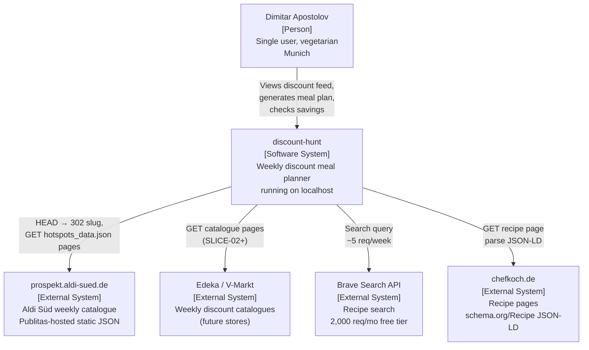
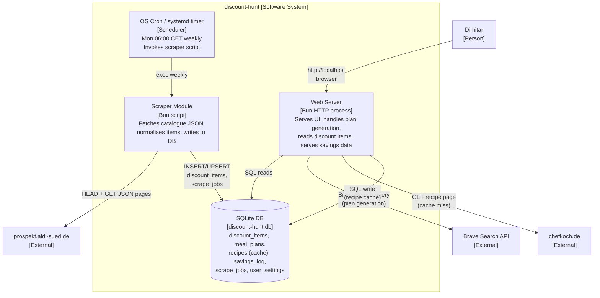
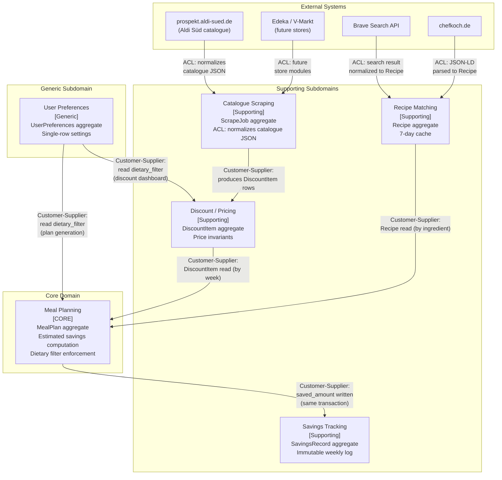
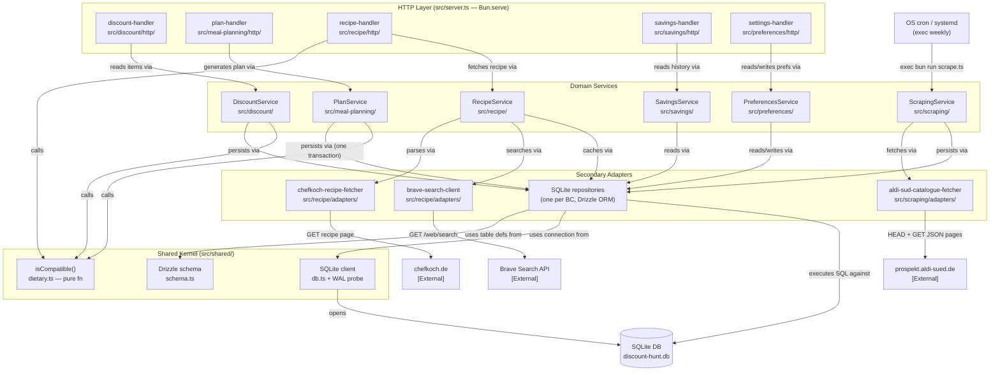

# Architecture Brief — discount-hunt

*SSOT for all architecture decisions. Each wave appends its section.*

---

## System Architecture

### Capacity Estimation

| Metric | Value | Notes |
|--------|-------|-------|
| Users | 1 | Single-user, no concurrency |
| Scrape volume | ~155 items/week | prospekt.aldi-sued.de catalogue |
| DB rows/year | ~8,000 discount items + ~260 recipes + ~52 plan rows | <5 MB/year |
| Recipe lookups | ~5/week | Brave API: ~260/year vs 2,000/mo free tier |
| QPS | < 1 | One human, a few clicks per week |
| Peak load | 1 person clicking "Generate Plan" | Plan generation <5s NFR easily met in-memory |
| Scraper runtime | ~30s once/week | Monday 06:00 CET |

**Implication:** Scale does not motivate any distributed infrastructure. Every complexity decision is resolved by simplicity, not capacity.

---

### Recommended Approach — Option A: Modular Monolith + OS Cron + SQLite

One Bun process serves HTTP and all application logic. A weekly OS-level cron job (or systemd timer) triggers the scraper as a one-shot script. SQLite stores all persistent data including recipe cache. No daemons beyond the web server.

**Rationale:**

| Criterion | Why this fits |
|-----------|--------------|
| Simplicity | One process. One file. `bun run start`, done. |
| Maintainability | No inter-process contracts, no port configuration, no message broker |
| Localhost deployment | No Docker required; runs as a plain process or a single systemd unit |
| Locale extensibility (D10) | Supported by a `store`/`locale` column + one scraper module per additional store — NOT by infra decomposition |
| SQLite at this scale | 4 MB/year, single writer (the scraper), reads from one human — SQLite's sweet spot |
| Recipe cache | Same SQLite table (`recipes`, `cached_at` column). 5 lookups/week justifies zero second stores |
| Schedule | OS cron decouples scrape liveness from web process uptime. Scrape succeeds even if browser is never opened |

---

### Rejected Alternative B — Web + Worker + In-Process Scheduler

A dedicated worker process (separate from the web server) that runs the scraper, with scheduling managed in-process via `node-cron` or similar.

**Why rejected:** At 0 concurrent users and one scrape per week, a permanent worker process burns memory 99.9% of the time doing nothing. In-process scheduling couples scraper liveness to web process uptime — if the web server crashes or is restarted, Monday's scrape is missed. OS-level cron (or systemd timer) is stateless, survives reboots, and runs independently of the web process. The added operational surface (two processes, inter-process communication) delivers no benefit for this workload.

---

### Rejected Alternative C — PostgreSQL + Redis + Message Queue

The "standard" web backend stack: PostgreSQL for persistence, Redis for caching, a job queue (BullMQ / pg-boss) for scheduling background work.

**Why rejected:** PostgreSQL requires a running daemon, `pg_ctl` lifecycle management, and connection pooling for a 4 MB, single-writer database. Redis is a second data store for a recipe cache that sees 5 writes per week. A job queue introduces broker infrastructure, worker registration, and failure retry logic for a task that runs once per week and can tolerate simple re-execution. The numbers make this unjustifiable: this is SQLite-sized data, cron-sized scheduling, and a single-human traffic profile. Every component in this stack would exist to solve problems this app does not have.

---

### C4 Context Diagram



---

### C4 Container Diagram



---

### Substrate Honesty Probes

Per Principle 9 (Earned Trust), each infrastructure component must empirically verify substrate claims at startup.

| Component | Substrate lie to probe | Probe | Action on failure |
|-----------|----------------------|-------|------------------|
| Scraper | Slug format drift (`kw{week}-{yy}-op-mp` may change) | On each run: validate 302 Location header matches expected pattern; validate page 2-3 returns `type: "product"` hotspots | Log `health.startup.refused`, retain stale data, emit staleness warning |
| Scraper | JSON shape change (`price`, `discountedPrice` fields absent) | Validate first parsed item has at least `title` and `price`; warn if both-price coverage drops below 10% | Log structured warning; proceed with available data; mark scrape as partial |
| Web server | SQLite WAL mode on this filesystem | On startup: write a probe row, read it back, delete it | Refuse to start if read-back fails |
| Web server | Data staleness (>48h since last scrape) | Read `scrape_jobs.last_successful_run` on every request | Display staleness warning banner (already an NFR) |
| Recipe fetcher | Chefkoch JSON-LD shape | Validate fetched page contains `@type: "Recipe"` with `recipeIngredient[]` | Fall back to cached content; set `source_url_valid = false` |

**Note on fsync:** Docker overlayfs may silently no-op `fsync`. If deployed in Docker (Option B deployment variant), SQLite must be configured with `PRAGMA journal_mode=WAL` and the startup probe must confirm WAL mode is active. On bare-process localhost, this risk is absent.

---

## Wave: DESIGN / [REF] System Architecture Decisions

*Continues from DISCUSS decisions D1–D10 (see feature-delta.md).*

| ID | Decision | Verdict | Rationale |
|----|----------|---------|-----------|
| D11 | Process topology | Modular monolith — one Bun HTTP process | 0 concurrent users, <1 QPS; second process adds operational cost with zero capacity benefit |
| D12 | Scheduler | OS cron (or systemd timer) — weekly, Monday 06:00 CET | Decouples scrape liveness from web process uptime; survives reboots; stateless |
| D13 | Database | SQLite (WAL mode) | <5 MB/year, single writer (scraper), reads from 1 human; Postgres adds daemon + ops with no benefit |
| D14 | Recipe cache | Same SQLite DB, `recipes` table, `cached_at` + 7-day TTL | 5 lookups/week; Redis is a second data store for nothing at this volume |
| D15 | Deployment | Bare process (default) or Docker Compose (optional) | Bare: zero overhead, fits personal machine. Compose: portable, one-command rebuild. Both valid — choose by homelab preference |
| D16 | Locale extensibility | `store` column + per-store scraper module | D10 requirement met by data model + module boundary, not by infra decomposition or queues |
| D17 | Bun TypeScript runtime | Bun (validated in SPIKE probe code) | Native TypeScript, fast startup, built-in HTTP server, compatible with planned scraper code |
| D18 | Scraper invocation | One-shot script (`bun run scrape.ts`), not a long-lived worker | Matches cron/systemd invocation model; no persistent connection or state required between runs |

---

## Domain Model

*Wave: DESIGN — Domain Modeling. Appended to System Architecture section above.*

### Subdomain Classification

| Subdomain | Class | Rationale |
|-----------|-------|-----------|
| Meal Planning | **Core** | The primary JTBD: discount-first, dietary-filtered 7-day plan. Unique to this app. All other contexts exist to serve it. |
| Discount / Pricing | Supporting | Provides the input data (discounted items, prices) but the data originates externally from store catalogues. |
| Recipe Matching | Supporting | External recipe data piped into the domain. Commodity pattern (search → parse). |
| Catalogue Scraping | Supporting | ACL boundary to external stores (Aldi Süd, Edeka, V-Markt). Infrastructure-adjacent but domain-relevant. |
| Savings Tracking | Supporting | Depends on Meal Planning output. Enables the habit loop but is not the core differentiator. |
| User Preferences | Generic | Single-row settings table. No domain logic — pure configuration. |

---

### Bounded Contexts

**Note:** Boundaries here are logical module boundaries, not deployment units. Per D11 (modular monolith), all contexts share one process and one SQLite file. The "independently deployable" criterion from DDD boundary validation is intentionally waived; context isolation is maintained through module discipline (separate directories, no cross-import of internal types).

| Context | Responsibility | Aggregate Roots | Tables | Integration Method |
|---------|---------------|-----------------|--------|--------------------|
| **Catalogue Scraping** | Fetches external store catalogues; normalizes raw JSON to domain objects; records scrape metadata | `ScrapeJob` | `scrape_jobs` | Invokes `RegisterDiscountItem` command on Discount/Pricing context (ACL to external stores) |
| **Discount / Pricing** | Owns discounted item records; enforces price invariants; resolves item availability | `DiscountItem` | `discount_items` | Customer: receives normalized data from Scraping context; Supplier to Meal Planning |
| **Meal Planning** | Generates dietary-filtered, discount-driven 7-day meal plan; coordinates item selection + recipe linking; computes and commits estimated savings | `MealPlan` | `meal_plans` | Customer: reads DiscountItem from Discount/Pricing, reads Recipe from Recipe Matching, reads UserPreferences from Preferences |
| **Recipe Matching** | Finds recipes for discounted ingredients via Brave Search + Chefkoch parse; maintains 7-day cache | `Recipe` | `recipes` | ACL to Brave Search API and chefkoch.de; Supplier to Meal Planning |
| **Savings Tracking** | Stores immutable weekly savings records; displays week/month history | `SavingsRecord` | `savings_log` | Customer: receives committed `saved_amount` from Meal Planning at plan-save time; read-only thereafter |
| **User Preferences** | Stores dietary restriction setting; single-user configuration | `UserPreferences` | `user_settings` | Supplier to Meal Planning (read at plan-generation time) |

---

### Aggregate Definitions

All aggregates are small (Vernon Rule 2: root entity + value-typed properties). No aggregate exceeds one entity. Cross-aggregate references use IDs only (Vernon Rule 3).

**Note on Principle 8 (Bounded-Change Universe):** For this domain (monolith, SQLite, no event store), the declared delta is the set of columns/rows that may change per command, and the complement is everything else that must remain unchanged. Specified below per aggregate.

---

#### ScrapeJob (Catalogue Scraping Context)

**Root entity:** `ScrapeJob`

**Full observable state:**
```
{ job_id, store, started_at, completed_at, status, item_count, error_message, last_successful_run }
```

**Invariants enforced:**
- `last_successful_run` updates only on `status = 'success'`, never on partial or failed scrapes.
- `item_count` reflects only items with both `price` (regular) and `discountedPrice` (sale) fields present in the catalogue JSON.

**Command → declared delta:**

| Command | May Change | Events (notional) | Complement (must NOT change) |
|---------|-----------|-------------------|-----------------------------|
| `StartScrape(store)` | `started_at`, `status='running'` | `ScrapeStarted` | `completed_at`, `last_successful_run`, `item_count` |
| `CompleteScrape(items[])` | `completed_at`, `status`, `item_count`, `last_successful_run` (if success) | `ScrapeCompleted` | `started_at`, `job_id`, `store` |
| `FailScrape(error)` | `completed_at`, `status='failed'`, `error_message` | `ScrapeFailed` | `last_successful_run` — MUST NOT update on failure |

---

#### DiscountItem (Discount / Pricing Context)

**Root entity:** `DiscountItem`

**Full observable state:**
```
{ item_id, store, name, category, regular_price, sale_price, valid_until, scraped_at, dietary_tags[] }
```

**Invariants enforced:**
- `regular_price IS NOT NULL AND regular_price > sale_price` — validated at creation; never writable after insert.
- `regular_price` is IMMUTABLE after creation. No command may change it. (CRITICAL: savings history depends on this value surviving beyond the promotional period.)
- Only items from the scraper with BOTH `price` and `discountedPrice` fields qualify. Items missing either field are discarded at the ACL boundary.
- `dietary_tags[]` is populated by the Catalogue Scraping ACL at normalization time using a static ingredient-keyword classifier (e.g., no meat/fish keywords → vegetarian). Discount/Pricing does not reclassify after creation.

**Command → declared delta:**

| Command | May Change | Events (notional) | Complement (must NOT change) |
|---------|-----------|-------------------|-----------------------------|
| `RegisterDiscountItem(...)` | All fields on INSERT | `DiscountItemRegistered` | — (new row) |
| `ExpireDiscountItem(item_id)` | `valid_until` set to past date | `DiscountItemExpired` | `regular_price`, `sale_price`, `name`, `store` |

No update command exists for `regular_price`. The complement equality for every command is: `regular_price` after == `regular_price` before.

---

#### MealPlan (Meal Planning Context — CORE)

**Root entity:** `MealPlan`

**Full observable state:**
```
{
  plan_id,
  week_start,          -- ISO date of the Monday
  generated_at,
  dietary_filter,      -- snapshot of restriction at generation time
  meals: [             -- value objects, not entities
    { meal_id, day, slot(lunch|dinner), name,
      discount_item_id | null,   -- ID reference only
      recipe_id | null           -- ID reference only
    }
  ],
  estimated_savings    -- SUM(regular_price - sale_price) for meals with discount_item_id
}
```

**Invariants enforced:**
- `dietary_filter` is captured at generation time (snapshot), not read live. History records are immutable to restriction changes.
- `estimated_savings` = `SUM(regular_price - sale_price)` for all meals referencing a `discount_item_id`. Computed once at plan-save time.
- `estimated_savings` written to `savings_log.saved_amount` in the **same SQLite transaction** as the plan insert. Equality is guaranteed by construction — no eventual consistency gap.
- `meals[]` reference `DiscountItem` and `Recipe` **by ID only**. No embedded copies.
- `MealPlan` is append-only per week. One plan per `week_start`. A regeneration replaces (deletes + reinserts) the plan row and the savings log entry atomically.
- **4-week recipe rotation invariant**: no `recipe_id` may be assigned to a meal in the generated plan if that `recipe_id` appears in any `meal_plans` row with `week_start >= (current_monday - 28 days)`. Enforced in `plan-service.ts` by querying `MealPlanRepository.getRecentRecipeIds(since)` before building the candidate set.

**Command → declared delta:**

| Command | May Change | Events (notional) | Complement (must NOT change) |
|---------|-----------|-------------------|-----------------------------|
| `GeneratePlan(week_start, filter)` | All fields on INSERT; `savings_log` row INSERT | `PlanGenerated` | — (new rows) |
| `RegeneratePlan(week_start, filter)` | Replaces `meal_plans` row; replaces `savings_log` row | `PlanRegenerated` | Prior weeks' `savings_log` rows — MUST NOT change |

---

#### Recipe (Recipe Matching Context)

**Root entity:** `Recipe`

**Full observable state:**
```
{ recipe_id, ingredient_name, title, source_url, source_url_valid, ingredients[], steps[], cached_at, cached_content }
```

**Invariants enforced:**
- `cached_content IS NOT NULL` at creation. Caching happens at fetch time; a recipe without cached content is not persisted.
- `cached_at` is the canonical freshness indicator. TTL = 7 days. After TTL expiry, a `RefreshRecipe` command re-fetches.
- `source_url_valid` reflects the last reachability check, not structural validity of the URL.

**Command → declared delta:**

| Command | May Change | Events (notional) | Complement (must NOT change) |
|---------|-----------|-------------------|-----------------------------|
| `CacheRecipe(ingredient_name, ...)` | All fields on INSERT | `RecipeCached` | — (new row) |
| `RefreshRecipe(recipe_id)` | `title`, `steps[]`, `ingredients[]`, `cached_at`, `source_url_valid` | `RecipeRefreshed` | `recipe_id`, `ingredient_name` |
| `MarkSourceDead(recipe_id)` | `source_url_valid = false` | `RecipeSourceInvalidated` | `cached_content` — must remain available |

---

#### SavingsRecord (Savings Tracking Context)

**Root entity:** `SavingsRecord`

**Full observable state:**
```
{ record_id, week_start, plan_id, saved_amount, total_sale_price, total_regular_price, item_count, created_at }
```

**Invariants enforced:**
- **Finalized (prior) weeks are IMMUTABLE.** A `SavingsRecord` for a closed week (any `week_start` before the current week's Monday) may never be updated or deleted.
- **Current week's record is replaceable** via `RegeneratePlan` (US-02). `RegeneratePlan` deletes and reinserts the `savings_log` row for the current `week_start` only, in the same SQLite transaction as the `meal_plans` row replacement. This is consistent with "regenerate this week's plan."
- `saved_amount = total_regular_price - total_sale_price`. Verified at creation. Never recomputed after the record is finalized.
- `saved_amount` must equal `MealPlan.estimated_savings` for the same `plan_id`. Enforced by the same-transaction write in Meal Planning.
- A prior week's record is never modified when dietary restrictions change (US-05 scenario 2).

**Command → declared delta:**

| Command | May Change | Events (notional) | Complement (must NOT change) |
|---------|-----------|-------------------|-----------------------------|
| `RecordSavings(plan_id, ...)` | All fields on INSERT | `SavingsRecorded` | — (new row) |
| `ReplaceSavings(week_start, plan_id, ...)` | Replaces row for current `week_start` only | `SavingsReplaced` | All rows where `week_start` < current week's Monday |

No command may touch a `SavingsRecord` row for a past (finalized) week. `ReplaceSavings` enforces a guard: `week_start` must equal the current week's Monday or the command is rejected.

---

#### UserPreferences (User Preferences Context)

**Root entity:** `UserPreferences`

**Full observable state:**
```
{ user_id, dietary_restrictions[], updated_at }
```

**Invariants enforced:**
- Single row (single-user app). `user_id` is always the constant `'dimitar'`.
- Changing `dietary_restrictions` does NOT retroactively alter past `MealPlan.dietary_filter` or `SavingsRecord` rows.

**Command → declared delta:**

| Command | May Change | Events (notional) | Complement (must NOT change) |
|---------|-----------|-------------------|-----------------------------|
| `UpdateDietaryRestrictions(restrictions[])` | `dietary_restrictions[]`, `updated_at` | `DietaryRestrictionsUpdated` | Past `meal_plans.dietary_filter` snapshots, all `savings_log` rows |

---

### Domain Events

Events are **domain-modeling constructs** realized as direct in-process calls and same-transaction DB writes. Per D11 (modular monolith), there is no message broker or event bus. These events represent what happened in the domain — they are named here to establish ubiquitous language and bounded-change contracts, not to imply a distributed architecture.

| Event | Trigger | Producer | Consumer(s) |
|-------|---------|----------|-------------|
| `ScrapeStarted` | Cron job invokes scraper script | Catalogue Scraping | Logging / `scrape_jobs` INSERT |
| `ScrapeCompleted` | All catalogue pages parsed successfully | Catalogue Scraping | Discount/Pricing (DiscountItem registration), `scrape_jobs` UPDATE |
| `ScrapeFailed` | HTTP error, JSON shape violation, or slug drift | Catalogue Scraping | `scrape_jobs` UPDATE; staleness warning in UI |
| `DiscountItemRegistered` | Scraper writes item with both `regular_price` and `sale_price` | Discount/Pricing | Available for Meal Planning reads |
| `DiscountItemExpired` | `valid_until` date passed | Discount/Pricing | Item excluded from new plan generation |
| `PlanGenerated` | User clicks "Generate Meal Plan" | Meal Planning | `meal_plans` INSERT + `savings_log` INSERT (same transaction) |
| `PlanRegenerated` | User clicks "Regenerate" | Meal Planning | `meal_plans` row replaced + current week's `savings_log` row replaced via `ReplaceSavings` (same transaction); prior weeks untouched |
| `RecipeCached` | Brave Search + Chefkoch fetch returns valid JSON-LD | Recipe Matching | `recipes` INSERT; available for MealPlan recipe_id reference |
| `RecipeRefreshed` | TTL expired; re-fetch succeeds | Recipe Matching | `recipes` UPDATE (except recipe_id, ingredient_name) |
| `RecipeSourceInvalidated` | Source URL returns non-2xx on check | Recipe Matching | `source_url_valid = false`; UI shows "cached version" notice |
| `SavingsRecorded` | MealPlan commit (same transaction as PlanGenerated) | Savings Tracking | `savings_log` INSERT; displayed in Savings Tracker view |
| `SavingsReplaced` | MealPlan regeneration (same transaction as PlanRegenerated) | Savings Tracking | Current week's `savings_log` row replaced; prior weeks' rows untouched |
| `DietaryRestrictionsUpdated` | User saves Settings | User Preferences | `user_settings` UPDATE; applies to next plan generation only |

---

### Context Map



**Context mapping patterns:**

| Relationship | Pattern | Rationale |
|-------------|---------|-----------|
| External stores → Catalogue Scraping | **ACL** | External catalogue JSON (Publitas format, Aldi Süd-specific) translated at boundary; protects domain from schema drift |
| Brave Search / Chefkoch → Recipe Matching | **ACL** | External API response and HTML JSON-LD translated to internal `Recipe` aggregate; substrate probes guard against shape changes |
| Catalogue Scraping → Discount/Pricing | **Customer-Supplier** | Scraping is upstream; Discount/Pricing is downstream consumer of normalized rows. Scraping owns the schema; Discount/Pricing conforms to it |
| Discount/Pricing → Meal Planning | **Customer-Supplier** | Discount/Pricing is upstream supplier; Meal Planning is downstream customer. Meal Planning reads by `week_start`; no negotiation needed at this scale |
| User Preferences → Meal Planning | **Customer-Supplier** | Preferences is upstream supplier; Meal Planning reads restriction at plan-generation time |
| User Preferences → Discount/Pricing | **Customer-Supplier** | Preferences is upstream supplier; Discount/Pricing reads restriction to filter the Discount Dashboard view. Both consumers read from the same source — critical because the registry flags this as HIGH-risk if any consumer derives the restriction independently |
| Recipe Matching → Meal Planning | **Customer-Supplier** | Recipe Matching is upstream supplier; Meal Planning consumes by `ingredient_name` (cache-first) |
| Meal Planning → Savings Tracking | **Customer-Supplier** | Meal Planning drives the savings write; Savings Tracking is a downstream append-only log. Same-transaction write makes this synchronous |

---

### ES/CQRS Assessment

Event Sourcing and CQRS are not warranted for discount-hunt. The decision heuristic from the ES/CQRS skill requires affirmative answers to at least two of: complete audit trail required (financial/regulatory), temporal queries, multiple divergent read models, complex state transitions, or event-driven integration with other systems. None apply here. There is one user, no concurrency, no regulatory audit requirements, and no need to replay history to reconstruct state. The single read model (SQLite tables) serves all views adequately at this volume (<5 MB/year). The immutability requirements that might superficially suggest ES — specifically `regular_price` immutability and `SavingsRecord` append-only semantics — are fully satisfied by SQL column-level constraints (`NOT NULL`, no `UPDATE` on that column, application-enforced insert-only for `savings_log`). The same-transaction write of `estimated_savings` → `savings_log.saved_amount` eliminates the eventual consistency gap that CQRS would introduce. ES would add event versioning complexity, a snapshot strategy, and a rehydration path for zero business benefit. Traditional state-based persistence with carefully designed insert-only tables is the correct choice.

---

## Wave: DESIGN / [REF] Domain Model Decisions

*Continues from D18 (System Architecture Decisions above).*

| ID | Decision | Verdict | Rationale |
|----|----------|---------|-----------|
| D19 | Bounded context count | 6 contexts (Catalogue Scraping, Discount/Pricing, Meal Planning, Recipe Matching, Savings Tracking, User Preferences) | DISCUSS identified 4; Meal Planning surfaced as explicit core context (owns plan generation + savings computation + dietary filter enforcement); User Preferences separated as generic supplier |
| D20 | Core subdomain | Meal Planning | Primary JTBD is discount-first dietary-filtered planning; all other contexts exist to serve it |
| D21 | DiscountItem ownership | Discount/Pricing context owns the aggregate; Catalogue Scraping is the ACL that writes it | Resolves the DISCUSS ambiguity where both contexts claimed `discount_items`; separates external normalization (Scraping) from domain invariant enforcement (Discount/Pricing) |
| D22 | regular_price immutability | Column is write-once at scrape time; no UPDATE command exists on that field | CRITICAL invariant (DISCUSS D8): savings history depends on this value surviving beyond the promotional period; enforced at application layer, not just DB constraint |
| D23 | estimated_savings consistency | `MealPlan.estimated_savings` and `savings_log.saved_amount` written in the same SQLite transaction | Eliminates the medium-risk consistency gap from the shared-artifacts-registry; equality is guaranteed by construction, not by reconciliation logic |
| D24 | SavingsRecord immutability scope | Finalized (prior) weeks are immutable — no UPDATE or DELETE permitted. Current week's record is replaceable via `ReplaceSavings` (same transaction as `RegeneratePlan`). Dietary restriction changes do not alter any past record. | Satisfies US-02 (regenerate this week) + US-04 scenario 4 + US-05 scenario 2. Resolves contradiction between "append-only log" and "regenerate replaces current week." |
| D25 | MealPlan dietary_filter snapshot | `meal_plans.dietary_filter` captures restriction at generation time | Decouples plan history from future settings changes; dietary restriction changes affect only future plans |
| D26 | Context boundary enforcement | Logical module boundaries (separate src/ directories, no cross-context type imports); no deployment boundary at this scale | Per D11 (modular monolith); "independently deployable" DDD criterion intentionally waived; isolation maintained by code discipline |
| D27 | ES / CQRS | Not warranted | 1 user, no concurrency, no audit regulation, no temporal queries, <5 MB/year; immutability requirements met by SQL constraints + insert-only pattern |
| D28 | Domain events as ubiquitous language only | Named events (PlanGenerated, ScrapeCompleted, etc.) document bounded-change contracts; realized as direct in-process calls, not messages | No broker infrastructure (D11); event names establish the canonical vocabulary crafters must use in code and logs |

---

## Application Architecture

*Wave: DESIGN — Application/Component Layer. Appended to Domain Model section above.*

### Component Decomposition

One row per bounded context. All modules share the single Bun HTTP process (D11) and single SQLite file (D13).

#### Catalogue Scraping — `src/scraping/`

| Layer | File | Responsibility |
|-------|------|----------------|
| Primary adapter (CLI) | `src/scraping/scraper-runner.ts` | Entry point for `bun run scrape.ts`; parses CLI args (store flag); delegates to `ScrapingService` |
| Domain service | `src/scraping/scraping-service.ts` | Orchestrates `ScrapeJob` lifecycle: `StartScrape` → fetch → normalize → `CompleteScrape`/`FailScrape` |
| ACL: Aldi Süd | `src/scraping/adapters/aldi-sud-catalogue-fetcher.ts` | HEAD→302 slug discovery; paginated `hotspots_data.json` fetch; returns raw catalogue JSON |
| ACL: Edeka | (not yet implemented) | FUTURE — planned in SLICE-02 but deferred; no file exists |
| ACL: V-Markt | `src/scraping/adapters/v-markt-catalogue-fetcher.ts` | Delivered S02 — PDF catalogue URL discovery via HEAD redirect; content extraction delegated to HaikuCatalogueExtractor |
| AI extractor | `src/scraping/adapters/haiku-catalogue-extractor.ts` | Claude Haiku vision call; extracts items from V-Markt PDF catalogue pages; returns NormalizedItem[] |
| ACL normalizer | `src/scraping/adapters/catalogue-normalizer.ts` | Translates store-specific JSON to `NormalizedItem`; applies `dietary_tags[]` classifier; enforces both-price filter (drops items missing `price` or `discountedPrice`) |
| Driven port (DB) | `src/scraping/ports/scrape-job-repository.ts` | Port interface: `startJob`, `completeJob`, `failJob` |
| Secondary adapter | `src/scraping/adapters/sqlite-scrape-job-repository.ts` | Drizzle ORM implementation of `ScrapeJobRepository`; writes `scrape_jobs` table |
| Substrate probe | `src/scraping/probes/catalogue-probe.ts` | Per-run: validates 302 slug pattern; validates first parsed item has `title` + `price`; logs `health.scrape.refused` on failure |

#### Discount / Pricing — `src/discount/`

| Layer | File | Responsibility |
|-------|------|----------------|
| Primary adapter (HTTP) | `src/discount/http/discount-handler.ts` | `GET /` — reads filtered discount items; passes `dietary_filter` from `UserPreferencesRepository` into query |
| Domain service | `src/discount/discount-service.ts` | `RegisterDiscountItem(normalizedItem)`: validates price invariants, persists; `GetWeeklyItems(filter)`: returns `DiscountItem[]` filtered by `isCompatible()` |
| Driven port (DB) | `src/discount/ports/discount-item-repository.ts` | Port: `register`, `getByWeek(weekStart, filter)`, `expire` |
| Secondary adapter | `src/discount/adapters/sqlite-discount-item-repository.ts` | Drizzle ORM; `discount_items` table; enforces `regular_price IS NOT NULL` at insert |

#### Meal Planning — `src/meal-planning/`

| Layer | File | Responsibility |
|-------|------|----------------|
| Primary adapter (HTTP) | `src/meal-planning/http/plan-handler.ts` | `GET /plan` — renders current week's plan; `POST /plan/generate` — triggers `GeneratePlan` use case |
| Domain service | `src/meal-planning/plan-service.ts` | `GeneratePlan(weekStart)`: reads `UserPreferences`, applies `isCompatible()` before selection, queries `getRecentRecipeIds(since: 4 weeks ago)` to exclude recently used recipes, maps items to meals, computes `estimated_savings`, writes plan + savings in one SQLite transaction |
| Driven port (DB) | `src/meal-planning/ports/meal-plan-repository.ts` | Port: `save(plan)`, `getByWeek(weekStart)`, `replaceCurrentWeek(plan)`, `getRecentRecipeIds(since: Date): RecipeId[]` |
| Secondary adapter | `src/meal-planning/adapters/sqlite-meal-plan-repository.ts` | Drizzle ORM; `meal_plans` table; `ReplaceSavings` called in same transaction |

#### Recipe Matching — `src/recipe/`

| Layer | File | Responsibility |
|-------|------|----------------|
| Primary adapter (HTTP) | `src/recipe/http/recipe-handler.ts` | `GET /plan/{meal_id}` — cache-first lookup; triggers `CacheRecipe` on miss |
| Domain service | `src/recipe/recipe-service.ts` | `GetRecipe(ingredientName)`: check TTL (7-day), return cached or trigger fetch; `CacheRecipe`, `RefreshRecipe`, `MarkSourceDead` use-case implementations |
| ACL: Brave Search | `src/recipe/adapters/brave-search-client.ts` | Brave Search API client; query `"{ingredient} vegetarisch Rezept"`; returns top-result URL; substrate probe on first call |
| ACL: Chefkoch parser | `src/recipe/adapters/chefkoch-recipe-fetcher.ts` | `GET recipe page`; parse `schema.org/Recipe` JSON-LD; return `Recipe` value object |
| Driven port (DB) | `src/recipe/ports/recipe-repository.ts` | Port: `getByIngredient(name)`, `cache(recipe)`, `refresh(id, data)`, `markDead(id)` |
| Secondary adapter | `src/recipe/adapters/sqlite-recipe-repository.ts` | Drizzle ORM; `recipes` table; enforces `cached_content IS NOT NULL` |
| Substrate probe | `src/recipe/probes/recipe-source-probe.ts` | Validates Brave API key responds; validates Chefkoch response contains `@type: "Recipe"` with `recipeIngredient[]` |

#### Savings Tracking — `src/savings/`

| Layer | File | Responsibility |
|-------|------|----------------|
| Primary adapter (HTTP) | `src/savings/http/savings-handler.ts` | `GET /savings` — renders weekly history and month-to-date total |
| Domain service | `src/savings/savings-service.ts` | `GetHistory()`: query `savings_log` ordered by `week_start DESC`; compute month-to-date; `RecordSavings` and `ReplaceSavings` invoked by `plan-service.ts` in same transaction (not via HTTP) |
| Driven port (DB) | `src/savings/ports/savings-repository.ts` | Port: `record(savingsRecord)`, `replace(weekStart, record)`, `getHistory()` |
| Secondary adapter | `src/savings/adapters/sqlite-savings-repository.ts` | Drizzle ORM; `savings_log` table; `replace` enforces `week_start >= currentMonday()` guard |

#### User Preferences — `src/preferences/`

| Layer | File | Responsibility |
|-------|------|----------------|
| Primary adapter (HTTP) | `src/preferences/http/settings-handler.ts` | `GET /settings` — renders settings form pre-populated with current restriction; `POST /settings` — calls `UpdateDietaryRestrictions` |
| Domain service | `src/preferences/preferences-service.ts` | `GetPreferences()`, `UpdateDietaryRestrictions(restrictions[])` — thin CRUD, no domain logic |
| Driven port (DB) | `src/preferences/ports/preferences-repository.ts` | Port: `get()`, `update(restrictions[])` |
| Secondary adapter | `src/preferences/adapters/sqlite-preferences-repository.ts` | Drizzle ORM; `user_settings` table; single-row, upsert on `user_id = 'dimitar'` |

#### Shared Kernel — `src/shared/`

| File | Responsibility | Contract shape |
|------|----------------|----------------|
| `src/shared/dietary.ts` | Exports `isCompatible(tags: DietaryTag[], restriction: DietaryRestriction): boolean` — the single dietary predicate; pure function | pure-function / return-only |
| `src/shared/schema.ts` | Drizzle table schema definitions shared across adapter implementations | N/A (data definition only) |
| `src/shared/types.ts` | Cross-context value types (`DietaryTag`, `DietaryRestriction`, `WeekStart`, `Money`) | N/A (type definitions only) |
| `src/shared/db.ts` | Drizzle client factory; SQLite WAL-mode startup probe (`write-read-delete` row test) | bounded-change — probe writes/deletes one probe row only |

**Shared Kernel rationale:** `src/shared/dietary.ts` is the sole sanctioned cross-context import, declared as Shared Kernel per DDD context mapping. All other cross-context communication goes through port interfaces and the SQLite DB. This is the explicit exception to D26 ("no cross-context type imports") — a deliberate Shared Kernel boundary, not a leak.

---

### Reuse Analysis

*Mandatory table per Principle 12 F-1 mandate. Greenfield — overlap analysis across proposed components. Contract shape per Principle 12 (Effect Isolation by Design).*

| Proposed Component | File | Overlap | Contract Shape | Universe | Assertion Mechanism | Decision | Justification |
|---|---|---|---|---|---|---|---|
| Dietary predicate | `src/shared/dietary.ts` | Consumed by 3 BCs: Discount, Meal Planning, Recipe Matching | pure-function / return-only | Input: `tags[]` + `restriction` only | Property-based test: `isCompatible(tags, restriction)` never mutates args; output determined solely by inputs | **Single shared function** (Shared Kernel) | Three independent implementations = guaranteed divergence; Shared Kernel makes the bug class "inconsistent filter" non-representable |
| Drizzle schema | `src/shared/schema.ts` | All 5 adapter implementations depend on table definitions | N/A — data definition | N/A | Import-linter rule: only `src/*/adapters/sqlite-*.ts` may import from `src/shared/schema.ts` | **Single shared schema** | DRY on column definitions; adapters own queries; no domain logic leaks via schema |
| SQLite client | `src/shared/db.ts` | All 5 secondary adapters need a DB connection | bounded-change | One probe row (`_probe` table) written + deleted at startup | Startup probe must succeed before first handler is registered; CI: WAL mode assertion | **Single factory** | Multiple clients = multiple WAL writers = SQLite locking issue; one connection instance is the correct SQLite pattern |
| Scrape-time `dietary_tags[]` classifier | `src/scraping/adapters/catalogue-normalizer.ts` | Tags produced here; `isCompatible()` in shared kernel consumes them | pure-function / return-only | Input: raw ingredient strings; output: `DietaryTag[]` | Unit test: known ingredient list → deterministic tag set | **Separate from predicate** (different responsibility: tag production vs compatibility check) | Classifier runs once at scrape time; predicate runs at query time; collapsing them couples scraper to preference model |
| `estimated_savings` computation | `src/meal-planning/plan-service.ts` | Appears in Meal Plan footer (US-02) and Savings Tracker (US-04) | pure-function / return-only | Input: `DiscountItem[]` with `regular_price` and `sale_price`; output: `Money` | Same-transaction write (plan INSERT + savings_log INSERT); test: both rows present or neither | **Single computation site** in `plan-service.ts`; written to both `meal_plans.estimated_savings` and `savings_log.saved_amount` in one transaction | Separate computation = consistency gap (registry risk MEDIUM); single computation + same-transaction write makes divergence non-representable |
| Recipe HTML fetcher | `src/recipe/adapters/chefkoch-recipe-fetcher.ts` | Only Chefkoch in SLICE-05; future stores could reuse parser interface | pure-function / return-only | Input: URL + raw HTML; output: `Recipe` or `null` | Substrate probe validates JSON-LD shape; unit test with fixture HTML | **Single file per site** under common `RecipeFetcher` port | Other recipe sites (AllRecipes, BBC Good Food) get separate adapters implementing the same port — swappable without changing `recipe-service.ts` |

---

### Driving Ports (Inbound Adapters)

| Route | HTTP Method | Handler File | Use Case | Bounded Context | Slice |
|-------|-------------|--------------|----------|-----------------|-------|
| `/` | GET | `src/discount/http/discount-handler.ts` | Display weekly discount feed filtered by dietary restriction | Discount / Pricing | S01 |
| `/plan` | GET | `src/meal-planning/http/plan-handler.ts` | Render current week's meal plan | Meal Planning | S01 |
| `/plan/generate` | POST | `src/meal-planning/http/plan-handler.ts` | Trigger `GeneratePlan` use case; redirect to `/plan` | Meal Planning | S01 |
| `/plan/:meal_id` | GET | `src/recipe/http/recipe-handler.ts` | Render recipe detail for a plan meal (cache-first, partial HTML swap via HTMX) | Recipe Matching | S05 |
| `/savings` | GET | `src/savings/http/savings-handler.ts` | Render weekly + monthly savings history | Savings Tracking | S01 (basic) / S04 (history) |
| `/settings` | GET | `src/preferences/http/settings-handler.ts` | Render settings form pre-populated with current restriction | User Preferences | S03 |
| `/settings` | POST | `src/preferences/http/settings-handler.ts` | `UpdateDietaryRestrictions`; redirect to `/settings` with toast | User Preferences | S03 |
| CLI: `bun run scrape.ts` | — | `src/scraping/scraper-runner.ts` | Invoke `ScrapingService`; one-shot, exit on completion | Catalogue Scraping | S01 |

**HTTP server entry point:** `src/server.ts` — registers all handlers with `Bun.serve` (see ADR-004); composition root: creates Drizzle client, runs SQLite WAL probe (`src/shared/db.ts`), then registers routes. Adapters that fail their probe cause the server to log `health.startup.refused` and exit with code 1.

---

### Driven Ports (Outbound Adapters)

| Port Interface | Adapter Implementation | Technology | Bounded Context | Substrate Probe | External Integration |
|---|---|---|---|---|---|
| `ScrapeJobRepository` | `sqlite-scrape-job-repository.ts` | Drizzle ORM / SQLite | Catalogue Scraping | WAL probe in `src/shared/db.ts` (shared) | No |
| `DiscountItemRepository` | `sqlite-discount-item-repository.ts` | Drizzle ORM / SQLite | Discount / Pricing | Shared WAL probe | No |
| `MealPlanRepository` | `sqlite-meal-plan-repository.ts` | Drizzle ORM / SQLite | Meal Planning | Shared WAL probe | No |
| `SavingsRepository` | `sqlite-savings-repository.ts` | Drizzle ORM / SQLite | Savings Tracking | Shared WAL probe | No |
| `PreferencesRepository` | `sqlite-preferences-repository.ts` | Drizzle ORM / SQLite | User Preferences | Shared WAL probe | No |
| `RecipeRepository` | `sqlite-recipe-repository.ts` | Drizzle ORM / SQLite | Recipe Matching | Shared WAL probe | No |
| `CatalogueFetcher` | `aldi-sud-catalogue-fetcher.ts` | `Bun.fetch` (built-in) | Catalogue Scraping | `catalogue-probe.ts` — slug 302 + item shape | Yes: prospekt.aldi-sued.de |
| `CatalogueFetcher` | `edeka-catalogue-fetcher.ts` | `Bun.fetch` | Catalogue Scraping | FUTURE — not implemented; Edeka blocked by Akamai Bot Manager | Yes: Edeka catalogue |
| `CatalogueFetcher` | `v-markt-catalogue-fetcher.ts` | `Bun.fetch` | Catalogue Scraping | Delivered S02 | Yes: V-Markt catalogue |
| `CatalogueExtractor` | `haiku-catalogue-extractor.ts` | Anthropic SDK (claude-haiku-4-5) | Catalogue Scraping | Delivered S02 | Yes: Anthropic API |
| `RecipeSearchClient` | `brave-search-client.ts` | `Bun.fetch` + Brave REST API | Recipe Matching | `recipe-source-probe.ts` — API key + response shape | Yes: api.search.brave.com |
| `RecipeFetcher` | `chefkoch-recipe-fetcher.ts` | `Bun.fetch` + JSON-LD parse | Recipe Matching | `recipe-source-probe.ts` — JSON-LD `@type: Recipe` check | Yes: chefkoch.de |

**External integrations requiring contract tests (handoff annotation for platform-architect):**
- Brave Search API (REST): consumer-driven contracts via Pact-JS in CI acceptance stage — detect breaking changes in `/web/search` response shape before production.
- chefkoch.de (schema.org JSON-LD): substrate probe is the primary guard; consider HTTP recording fixture tests (e.g., `nock` or Bun fetch mock) to detect JSON-LD schema drift in CI.

---

### Dietary Filter Enforcement

The dietary restriction is enforced as a single invariant via the **Shared Kernel function** `isCompatible(tags: DietaryTag[], restriction: DietaryRestriction): boolean` in `src/shared/dietary.ts`. This pure function is the sole point of truth for compatibility logic. Three consumers (Discount dashboard at `GET /`, `GeneratePlan` in `plan-service.ts`, and recipe ingredient display in `recipe-handler.ts`) all import and call `isCompatible()` — they never re-implement the predicate. The `DietaryRestriction` value is always sourced from `UserPreferencesRepository.get()` at call time; no consumer caches or hardcodes the restriction. The application boundary invariant is: **no `DiscountItem` may appear in a generated plan, a dashboard listing, or a recipe ingredient highlight unless `isCompatible(item.dietary_tags, preferences.dietary_restrictions)` returns `true`**. Enforcement layers: (1) `isCompatible()` as Shared Kernel (structural — wrong predicate becomes a compile error); (2) import-linter rule forbidding dietary filtering logic outside `src/shared/dietary.ts` (static enforcement); (3) property-based test on `isCompatible()` covering all `DietaryTag × DietaryRestriction` combinations (behavioral — mutation-tested). The dietary classifier (keyword → `DietaryTag[]`) runs exclusively at scrape time in `src/scraping/adapters/catalogue-normalizer.ts` and is a separate responsibility from the compatibility predicate.

**Application boundary (plain language):** In `GeneratePlan`, filter `DiscountItem[]` with `isCompatible()` **before** building the candidate set for meal assignment — not after. No meal is assigned without passing the predicate. This is an unconditional pre-condition, not a post-filter.

---

### C4 Component Diagram



---

### Slice → Component Map

*Last updated: 2026-07-14 — S01 + S02 DELIVERED*

| Component | First slice | S02 Status | Incremental additions |
|---|---|---|---|
| `src/scraping/scraper-runner.ts` | S01 | IMPLEMENTED | S03: no change expected |
| `src/scraping/scraping-service.ts` | S01 | IMPLEMENTED | S03: no change expected |
| `src/scraping/adapters/aldi-sud-catalogue-fetcher.ts` | S01 | IMPLEMENTED | — |
| `src/scraping/adapters/catalogue-normalizer.ts` | S01 | IMPLEMENTED | S03: validate all dietary tags covered |
| `src/scraping/adapters/edeka-catalogue-fetcher.ts` | FUTURE | NOT IMPLEMENTED | Edeka deferred — blocked by Akamai Bot Manager |
| `src/scraping/adapters/v-markt-catalogue-fetcher.ts` | S02 | IMPLEMENTED | — |
| `src/scraping/adapters/haiku-catalogue-extractor.ts` | S02 | IMPLEMENTED | — |
| `src/scraping/probes/catalogue-probe.ts` | S01 | IMPLEMENTED | S02: per-store probe instances |
| `src/discount/http/discount-handler.ts` | S01 | IMPLEMENTED | S03: passes `dietary_filter` to `getByWeek` |
| `src/discount/discount-service.ts` | S01 | IMPLEMENTED | S03: `isCompatible()` applied in `getByWeek` |
| `src/discount/adapters/sqlite-discount-item-repository.ts` | S01 | IMPLEMENTED | — |
| `src/meal-planning/http/plan-handler.ts` | S01 | IMPLEMENTED | S02: 7-day render; S03: no change (filter already in service) |
| `src/meal-planning/plan-service.ts` | S01 (1-meal stub) | IMPLEMENTED (S01 stub) | S02: full 7-day algorithm; S03: `isCompatible()` pre-filter hardened |
| `src/meal-planning/adapters/sqlite-meal-plan-repository.ts` | S01 | IMPLEMENTED | S04: `replaceCurrentWeek` tested with history |
| `src/savings/http/savings-handler.ts` | S01 (current week only) | IMPLEMENTED (S01 scope) | S04: historical list + month-to-date |
| `src/savings/savings-service.ts` | S01 | IMPLEMENTED | S04: `getHistory()` + month aggregation |
| `src/savings/adapters/sqlite-savings-repository.ts` | S01 | IMPLEMENTED | S04: history queries |
| `src/preferences/http/settings-handler.ts` | S03 | PLANNED | — |
| `src/preferences/preferences-service.ts` | S03 | PLANNED | — |
| `src/preferences/adapters/sqlite-preferences-repository.ts` | S03 | PLANNED | — |
| `src/recipe/http/recipe-handler.ts` | S05 | PLANNED | — |
| `src/recipe/recipe-service.ts` | S01 (stub: hardcoded URL) | IMPLEMENTED (stub) | S05: real Brave + Chefkoch integration |
| `src/recipe/adapters/brave-search-client.ts` | S05 | PLANNED | — |
| `src/recipe/adapters/chefkoch-recipe-fetcher.ts` | S05 | PLANNED | — |
| `src/recipe/adapters/sqlite-recipe-repository.ts` | S01 (stub cache) | IMPLEMENTED (stub) | S05: TTL refresh + `markDead` |
| `src/recipe/probes/recipe-source-probe.ts` | S05 | PLANNED | — |
| `src/shared/dietary.ts` | S01 | IMPLEMENTED | S03: full restriction enum; S05: tags cross-checked against recipe ingredients |
| `src/shared/schema.ts` | S01 | IMPLEMENTED | Each slice adds table definitions as new tables are introduced |
| `src/shared/db.ts` | S01 | IMPLEMENTED | — |
| `src/server.ts` | S01 | IMPLEMENTED | Each slice: new handler registered |

---

## Wave: DESIGN / [REF] Application Architecture Decisions

*Continues from D28 (Domain Model Decisions above).*

| ID | Decision | Verdict | Rationale |
|----|----------|---------|-----------|
| D29 | HTTP server | `Bun.serve` (built-in) | Zero dependencies; Bun runtime already mandated (D17); sufficient for single-user <1 QPS workload; Hono and Elysia rejected (see ADR-004) |
| D30 | ORM + migrations | Drizzle ORM + Drizzle Kit | Type-safe schema enforces `regular_price IS NOT NULL` and other invariants at compile time; Drizzle Kit generates migration SQL files (versionable, inspectable); bun:sqlite direct rejected (no schema type safety, migration management is manual); Prisma rejected (heavyweight, generates client, non-Bun-native runtime) |
| D31 | Frontend rendering | Server-rendered HTML + HTMX for partial swaps | No build step; no JS framework dependency; HTMX `hx-get` on meal titles satisfies US-03 AC ("opens without full page reload"); SPA (React/Svelte) rejected — unjustified complexity for single-user, no client-side state management need |
| D32 | Test framework | Bun test (built-in) | Zero additional dependency; compatible with D17; Vitest rejected (requires Node.js-compatible runtime config, adds a dev dependency for no benefit when Bun test is equivalent) |
| D33 | Dietary filter enforcement | `isCompatible()` Shared Kernel in `src/shared/dietary.ts` | Solves registry HIGH risk: three consumers cannot diverge if there is only one predicate; declared Shared Kernel (explicit D26 exception); import-linter enforces no other file reimplements the predicate |
| D34 | Architectural enforcement | `dependency-cruiser` configured to enforce: (a) no cross-context imports except from `src/shared/`; (b) only `src/*/adapters/sqlite-*.ts` may import `src/shared/schema.ts`; (c) no domain service imports HTTP handler | Principle 11: architecture rules without enforcement erode; pre-commit hook + CI check |
| D35 | Composition root | `src/server.ts` — wire → probe → register routes | Implements "wire then probe then use" invariant (Principle 13); adapters that fail probe cause `health.startup.refused` + process exit code 1 before any route is registered |
| D36 | Recipe rotation window | 4-week exclusion — `GeneratePlan` excludes any `recipe_id` used in the last 28 days | Prevents weekly repetition of the same recipe when the same ingredient recurs on sale; enforced in `plan-service.ts` via `getRecentRecipeIds(since)` pre-filter; window is a named constant (`RECIPE_ROTATION_DAYS = 28`) for future tunability |
| D37 | Plan generation contract shape | `generatePlan(weekStart, preferences): MealPlan` — pure computation returning a `MealPlan` value; `savePlan(plan): void` is the only impure function (writes to DB + savings_log in one transaction) | Plan-value pattern (Principle 12): `generatePlan` cannot silently write; the bug class "preview wrote to savings_log" becomes structurally impossible |
